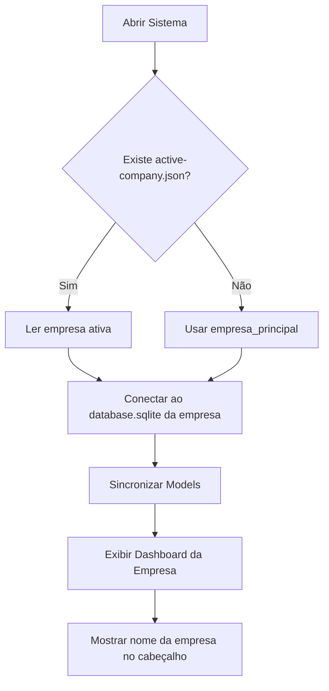
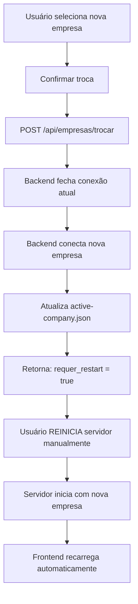
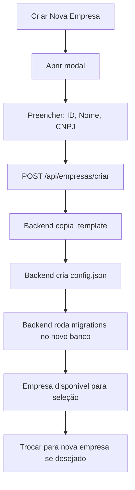

# RELATÓRIO TÉCNICO: Adaptação Multi-Empresa
## Sistema de Controle Financeiro de Locadora

---

## 1. Diagnóstico Atual

### 1.1 Arquitetura Existente

O sistema atual é **100% mono-empresa**. Não existe nenhum conceito de tenant, company_id, ou separação de dados por empresa.

**Stack Tecnológica:**
- **Backend:** Node.js + Express
- **ORM:** Sequelize
- **Banco:** SQLite (arquivo único)
- **Frontend:** EJS (server-side rendering)
- **Ambiente:** Produção/Teste separados via variável `NODE_ENV`

### 1.2 Estrutura de Dados

**Localização do banco:** Controlada por variável de ambiente `DATABASE_STORAGE`
- **Produção:** `data/prod/database.sqlite`
- **Teste:** `data/test/database_test.sqlite`

**Models identificados (8):**
1. **Veiculo** - PK: placa
2. **Cliente** - PK: nome
3. **Semana** - Períodos de controle
4. **LinhaSemana** - Detalhes semanais por veículo
5. **Multa** - Infrações e cobranças
6. **Credito** - Lançamentos de crédito
7. **Debito** - Lançamentos de débito  
8. **Encerramento** - Contratos finalizados

### 1.3 Pontos de Acoplamento com Empresa Única

#### 🔴 **CRÍTICO: Conexão hardcoded**

**Arquivo:** [`server/config/database-sqlite.js`](file:///c:/Landim/ControleFinanceiro/server/config/database-sqlite.js)

```javascript
const dbStorage = process.env.DATABASE_STORAGE || 'data/prod/database.sqlite';
const storagePath = path.resolve(process.cwd(), dbStorage);

const sequelize = new Sequelize({
    dialect: 'sqlite',
    storage: storagePath,
    logging: isTestEnv ? false : (msg) => console.log(`[SQL] ${msg}`)
});

export default sequelize; // ← Singleton global exportado
```

**Problema:** Todos os models importam esta instância única:
- `import sequelize from '../config/database-sqlite.js'`
- **Uma vez inicializado, o caminho do banco não pode mudar**
- Trocar de empresa **requer restart completo da aplicação**

#### 🔴 **Models sem conceito de empresa**

Nenhuma tabela possui campo `company_id` ou similar. Exemplos:

```javascript
// Veiculo.js
const Veiculo = sequelize.define('Veiculo', {
    placa: { type: DataTypes.STRING, primaryKey: true },
    modelo: { type: DataTypes.STRING },
    // ... sem company_id
});

// Cliente.js
const Cliente = sequelize.define('Cliente', {
    nome: { type: DataTypes.STRING, primaryKey: true },
    // ... sem company_id
});
```

#### 🔴 **Migration Runner mono-base**

**Arquivo:** [`server/migration-runner.js`](file:///c:/Landim/ControleFinanceiro/server/migration-runner.js)

```javascript
const dbStorage = process.env.DATABASE_STORAGE || 'data/prod/database.sqlite';
const DB_PATH = path.resolve(__dirname, '../', dbStorage);
this.db = new Database(DB_PATH); // ← Singleton
```

- Migrations aplicadas em **um único banco**
- Criar nova empresa **exigiria rodar migrations manualmente** por base

#### 🔴 **Frontend sem contexto de empresa**

- **Nenhuma** interface para seleção de empresa
- **Nenhum** estado global de empresa ativa
- Todas as telas assumem dados de empresa única

#### 🔴 **Backups mono-empresa**

```javascript
// migration-runner.js
const backupPath = path.join(BACKUPS_DIR, backupName);
await fs.copy(DB_PATH, backupPath);
```

- Backups salvos na pasta `backups/` sem organização por empresa
- Não há como restaurar empresa específica isoladamente

---

## 2. Problemas se Tentar Usar Várias Empresas Hoje

### 2.1 Mistura de Dados (CATASTRÓFICO) 🚨

Se você simplesmente criar registros de diferentes empresas no banco atual:

❌ **Veículos de todas as empresas apareceriam juntos**
- Placa `ABC-1234` da Empresa A
- Placa `ABC-1234` da Empresa B → **CONFLITO de PK**

❌ **Clientes com mesmo nome colidiriam**
- Cliente "João Silva" da Empresa A
- Cliente "João Silva" da Empresa B → **CONFLITO de PK**

❌ **Relatórios financeiros totalmente quebrados**
- Dashboard mostraria **soma de todas as empresas**
- Não seria possível filtrar por empresa

❌ **Risco contábil inaceitável**
- Confusão entre contas a receber
- Mistura de inadimplências
- Impossível auditoria por empresa

### 2.2 Impossibilidade de Troca em Runtime

Como a conexão Sequelize é **singleton global**:

```javascript
// Tentativa ingênua (NÃO FUNCIONA):
process.env.DATABASE_STORAGE = 'data/empresa2/database.sqlite';
// ← sequelize JÁ foi inicializado com empresa1
```

**Consequência:** Para trocar de empresa seria necessário:
1. Encerrar o servidor Node.js
2. Alterar variável de ambiente
3. Reiniciar o servidor
4. Recarregar a página

**Inviável** para uso operacional.

### 2.3 Backups e Restauração Impossíveis

- Não há como fazer backup apenas dos dados da Empresa A
- Restaurar uma empresa **sobrescreveria todas as outras**
- Exportação de dados por empresa: **inexistente**

### 2.4 Criação de Nova Empresa: Manual e Propenso a Erros

Passos atuais necessários:
1. Criar pasta manualmente
2. Copiar arquivo `.sqlite` vazio ou rodar schema
3. Executar todas as migrations
4. Configurar seeds se necessário
5. Alterar `.env` para apontar para nova base
6. Reiniciar servidor

**Tempo estimado:** 15-30 minutos  
**Risco de erro:** Alto

---

## 3. Arquitetura Recomendada (SIMPLIFICADA)

### 3.1 Princípio: Isolamento Físico Total

> **1 Empresa = 1 Banco SQLite = 1 Pasta**

✅ **Vantagens desta abordagem:**
- **Segurança máxima:** Dados nunca se misturam
- **Backup trivial:** Copiar pasta = backup completo
- **Restauração isolada:** Restaurar não afeta outras empresas
- **Auditoria simples:** Um arquivo `.sqlite` por empresa
- **Exportação/importação:** Copiar pasta inteira
- **Performance:** Sem overhead de filtragem por `company_id`
- **Simplicidade:** Evita complexidade de multi-tenant

### 3.2 Estrutura de Pastas Proposta

```
c:\Landim\ControleFinanceiro\
│
├── data\
│   ├── empresas\
│   │   ├── empresa_principal\
│   │   │   ├── database.sqlite
│   │   │   └── config.json (nome, CNPJ, etc)
│   │   │
│   │   ├── empresa_filial_sp\
│   │   │   ├── database.sqlite
│   │   │   └── config.json
│   │   │
│   │   ├── empresa_filial_rj\
│   │   │   ├── database.sqlite
│   │   │   └── config.json
│   │   │
│   │   └── .template\
│   │       ├── database.sqlite (schema vazio)
│   │       └── config.json (template)
│   │
│   └── test\
│       └── database_test.sqlite (mantido)
│
├── backups\
│   ├── empresa_principal\
│   │   ├── 2026-02-04_manual.db
│   │   └── 2026-02-04_pre-migration.db
│   │
│   ├── empresa_filial_sp\
│   │   └── 2026-02-04_manual.db
│   │
│   └── empresa_filial_rj\
│       └── 2026-02-04_manual.db
│
└── server\
    └── config\
        └── active-company.json (empresa ativa no momento)
```

### 3.3 Arquivo `config.json` por Empresa

**Exemplo:** `data/empresas/empresa_principal/config.json`

```json
{
  "id": "empresa_principal",
  "nome": "Locadora Exemplo Ltda",
  "cnpj": "12.345.678/0001-90",
  "ativa": true,
  "criada_em": "2026-02-04T00:00:00Z",
  "ultima_atualizacao": "2026-02-04T00:00:00Z"
}
```

**Uso:**
- Exibir nome da empresa no cabeçalho
- Validar empresa antes de conectar
- Listar empresas disponíveis

### 3.4 Arquivo de Controle Global

**`server/config/active-company.json`**

```json
{
  "empresa_ativa": "empresa_principal",
  "ultima_troca": "2026-02-04T00:30:00Z"
}
```

**Uso:**
- Determinar qual empresa carregar ao iniciar servidor
- Persistir escolha do usuário entre sessões

---

## 4. Mudanças Necessárias no Backend

### 4.1 Refatorar `database-sqlite.js`

**ANTES (atual):**
```javascript
const dbStorage = process.env.DATABASE_STORAGE || 'data/prod/database.sqlite';
const sequelize = new Sequelize({ storage: storagePath });
export default sequelize; // ← Singleton
```

**DEPOIS (proposto):**
```javascript
import { Sequelize } from 'sequelize';
import path from 'path';
import fs from 'fs';

let sequelizeInstance = null;

/**
 * Obtém empresa ativa do arquivo de controle
 */
function getActiveCompany() {
    const configPath = path.resolve(process.cwd(), 'server/config/active-company.json');
    if (!fs.existsSync(configPath)) {
        return 'empresa_principal'; // padrão
    }
    const config = JSON.parse(fs.readFileSync(configPath, 'utf8'));
    return config.empresa_ativa;
}

/**
 * Conecta ao banco da empresa especificada
 */
function connectToCompany(empresaId) {
    const env = process.env.NODE_ENV || 'production';
    
    // Ambiente de teste mantém comportamento atual
    if (env === 'test') {
        const testPath = path.resolve(process.cwd(), 'data/test/database_test.sqlite');
        return new Sequelize({ dialect: 'sqlite', storage: testPath, logging: false });
    }
    
    // Produção: usar pasta de empresas
    const dbPath = path.resolve(process.cwd(), `data/empresas/${empresaId}/database.sqlite`);
    
    // Validação de segurança
    if (!fs.existsSync(dbPath)) {
        throw new Error(`Banco da empresa "${empresaId}" não encontrado: ${dbPath}`);
    }
    
    console.log(`[DATABASE] Conectando à empresa: ${empresaId}`);
    console.log(`[DATABASE] Storage: ${dbPath}`);
    
    return new Sequelize({
        dialect: 'sqlite',
        storage: dbPath,
        logging: (msg) => console.log(`[SQL] ${msg}`)
    });
}

/**
 * Inicializa conexão com empresa ativa
 */
export function initDatabase() {
    if (sequelizeInstance) {
        throw new Error('Banco já inicializado. Use switchCompany() para trocar.');
    }
    
    const empresaId = getActiveCompany();
    sequelizeInstance = connectToCompany(empresaId);
    return sequelizeInstance;
}

/**
 * Troca de empresa em runtime (requer reinicialização de models)
 */
export async function switchCompany(novaEmpresaId) {
    console.log(`[DATABASE] Trocando de empresa para: ${novaEmpresaId}`);
    
    // Fechar conexão atual
    if (sequelizeInstance) {
        await sequelizeInstance.close();
    }
    
    // Conectar nova empresa
    sequelizeInstance = connectToCompany(novaEmpresaId);
    
    // Atualizar arquivo de controle
    const configPath = path.resolve(process.cwd(), 'server/config/active-company.json');
    fs.writeFileSync(configPath, JSON.stringify({
        empresa_ativa: novaEmpresaId,
        ultima_troca: new Date().toISOString()
    }));
    
    // IMPORTANTE: Models precisam ser re-sincronizados
    // Em produção, isso exige RESTART do servidor
    return sequelizeInstance;
}

/**
 * Obtém instância ativa (compatibilidade com código atual)
 */
export function getDatabase() {
    if (!sequelizeInstance) {
        throw new Error('Banco não inicializado. Chame initDatabase() primeiro.');
    }
    return sequelizeInstance;
}

// Inicialização automática (compatibilidade)
if (process.env.NODE_ENV !== 'test') {
    initDatabase();
}

export default getDatabase();
```

### 4.2 Atualizar Models

**ANTES:**
```javascript
import sequelize from '../config/database-sqlite.js';
const Veiculo = sequelize.define('Veiculo', { ... });
```

**DEPOIS:**
```javascript
import { getDatabase } from '../config/database-sqlite.js';
const sequelize = getDatabase();
const Veiculo = sequelize.define('Veiculo', { ... });
```

**Observação:** Como Sequelize define models no momento da importação, **trocar de empresa exigirá restart do servidor**. Não há forma simples de "redefinir" models em runtime sem complexidade excessiva.

### 4.3 Criar Serviço de Gerenciamento de Empresas

**Novo arquivo:** `server/services/EmpresaService.js`

```javascript
import fs from 'fs-extra';
import path from 'path';

const EMPRESAS_DIR = path.resolve(process.cwd(), 'data/empresas');
const TEMPLATE_DIR = path.join(EMPRESAS_DIR, '.template');

class EmpresaService {
    
    // Listar todas as empresas
    static async listarEmpresas() {
        const pastas = await fs.readdir(EMPRESAS_DIR);
        const empresas = [];
        
        for (const pasta of pastas) {
            if (pasta === '.template') continue;
            
            const configPath = path.join(EMPRESAS_DIR, pasta, 'config.json');
            if (await fs.pathExists(configPath)) {
                const config = await fs.readJson(configPath);
                empresas.push(config);
            }
        }
        
        return empresas;
    }
    
    // Criar nova empresa
    static async criarEmpresa(empresaId, dadosEmpresa) {
        const empresaPath = path.join(EMPRESAS_DIR, empresaId);
        
        // Validar se já existe
        if (await fs.pathExists(empresaPath)) {
            throw new Error(`Empresa "${empresaId}" já existe`);
        }
        
        // Copiar template
        await fs.copy(TEMPLATE_DIR, empresaPath);
        
        // Criar config.json
        const config = {
            id: empresaId,
            nome: dadosEmpresa.nome,
            cnpj: dadosEmpresa.cnpj || null,
            ativa: true,
            criada_em: new Date().toISOString(),
            ultima_atualizacao: new Date().toISOString()
        };
        
        await fs.writeJson(path.join(empresaPath, 'config.json'), config, { spaces: 2 });
        
        console.log(`✅ Empresa "${empresaId}" criada com sucesso`);
        return config;
    }
    
    // Exportar empresa inteira
    static async exportarEmpresa(empresaId, destinoZip) {
        const empresaPath = path.join(EMPRESAS_DIR, empresaId);
        // Implementar compactação ZIP
        // (requer biblioteca adicional como 'archiver')
    }
    
    // Importar empresa
    static async importarEmpresa(arquivoZip, novoId) {
        // Descompactar e validar estrutura
    }
    
    // Backup de empresa específica
    static async backupEmpresa(empresaId) {
        const empresaPath = path.join(EMPRESAS_DIR, empresaId);
        const backupDir = path.resolve(process.cwd(), `backups/${empresaId}`);
        await fs.ensureDir(backupDir);
        
        const timestamp = new Date().toISOString().replace(/[:.]/g, '-').slice(0, 10);
        const backupPath = path.join(backupDir, `${timestamp}_manual.db`);
        
        const dbPath = path.join(empresaPath, 'database.sqlite');
        await fs.copy(dbPath, backupPath);
        
        console.log(`✅ Backup criado: ${backupPath}`);
        return backupPath;
    }
}

export default EmpresaService;
```

### 4.4 Criar Endpoint para Trocar Empresa

**Novo arquivo:** `server/routes/empresas.js`

```javascript
import express from 'express';
import EmpresaService from '../services/EmpresaService.js';
import { switchCompany } from '../config/database-sqlite.js';

const router = express.Router();

// Listar empresas disponíveis
router.get('/', async (req, res) => {
    try {
        const empresas = await EmpresaService.listarEmpresas();
        res.json(empresas);
    } catch (error) {
        res.status(500).json({ error: error.message });
    }
});

// Trocar empresa ativa (EXIGE RESTART)
router.post('/trocar', async (req, res) => {
    try {
        const { empresaId } = req.body;
        await switchCompany(empresaId);
        
        // IMPORTANTE: Avisar frontend que precisa recarregar
        res.json({ 
            success: true, 
            message: 'Empresa trocada. REINICIE o servidor para aplicar.',
            requer_restart: true 
        });
    } catch (error) {
        res.status(500).json({ error: error.message });
    }
});

// Criar nova empresa
router.post('/criar', async (req, res) => {
    try {
        const { empresaId, dados } = req.body;
        const empresa = await EmpresaService.criarEmpresa(empresaId, dados);
        res.json(empresa);
    } catch (error) {
        res.status(400).json({ error: error.message });
    }
});

export default router;
```

**Registrar em** `server/index.js`:
```javascript
import empresasRoutes from './routes/empresas.js';
app.use('/api/empresas', empresasRoutes);
```

### 4.5 Atualizar Migration Runner

**Modificações em** `server/migration-runner.js`:

```javascript
// Adicionar parâmetro --empresa
const empresaId = process.argv[3] || getActiveCompany();
const dbPath = path.resolve(__dirname, `../data/empresas/${empresaId}/database.sqlite`);

// Exemplo de uso:
// npm run migrate -- empresa_principal
// npm run migrate -- empresa_filial_sp
```

---

## 5. Mudanças Necessárias no Frontend

### 5.1 Criar Componente Seletor de Empresa

**Novo arquivo:** `views/partials/company-selector.ejs`

```html
<!-- Seletor de Empresa (Navbar) -->
<div class="company-selector">
    <label for="empresa-select">Empresa:</label>
    <select id="empresa-select" onchange="trocarEmpresa()">
        <!-- Preenchido via JS -->
    </select>
    <span id="empresa-status" class="status-indicator"></span>
</div>

<script>
async function carregarEmpresas() {
    const res = await fetch('/api/empresas');
    const empresas = await res.json();
    
    const select = document.getElementById('empresa-select');
    empresas.forEach(emp => {
        const option = document.createElement('option');
        option.value = emp.id;
        option.textContent = emp.nome;
        if (emp.ativa) option.selected = true;
        select.appendChild(option);
    });
}

async function trocarEmpresa() {
    const empresaId = document.getElementById('empresa-select').value;
    
    if (!confirm(`Trocar para empresa "${empresaId}"? Isso REINICIARÁ o servidor.`)) {
        return;
    }
    
    const res = await fetch('/api/empresas/trocar', {
        method: 'POST',
        headers: { 'Content-Type': 'application/json' },
        body: JSON.stringify({ empresaId })
    });
    
    const data = await res.json();
    
    if (data.requer_restart) {
        alert('Empresa trocada! Por favor, REINICIE o servidor manualmente.');
        // Ou implementar restart automático via script
    }
}

carregarEmpresas();
</script>
```

### 5.2 Exibir Empresa Ativa no Layout

**Modificar:** `views/layouts/main.ejs`

```html
<header>
    <h1>Controle Financeiro - <span id="empresa-nome">Carregando...</span></h1>
    <%- include('../partials/company-selector') %>
</header>

<script>
// Carregar empresa ativa ao carregar página
fetch('/api/empresas')
    .then(res => res.json())
    .then(empresas => {
        const ativa = empresas.find(e => e.ativa);
        document.getElementById('empresa-nome').textContent = ativa?.nome || 'N/A';
    });
</script>
```

### 5.3 Modal para Criar Nova Empresa

**Novo arquivo:** `views/partials/modal-nova-empresa.ejs`

```html
<div id="modal-nova-empresa" class="modal" style="display:none;">
    <div class="modal-content">
        <h2>Criar Nova Empresa</h2>
        <form id="form-nova-empresa">
            <label>ID da Empresa (slug):</label>
            <input type="text" name="empresaId" required pattern="[a-z0-9_]+" 
                   placeholder="empresa_filial_sp">
            
            <label>Nome da Empresa:</label>
            <input type="text" name="nome" required>
            
            <label>CNPJ (opcional):</label>
            <input type="text" name="cnpj">
            
            <button type="submit">Criar</button>
            <button type="button" onclick="fecharModal()">Cancelar</button>
        </form>
    </div>
</div>

<script>
document.getElementById('form-nova-empresa').addEventListener('submit', async (e) => {
    e.preventDefault();
    const formData = new FormData(e.target);
    
    const dados = {
        empresaId: formData.get('empresaId'),
        dados: {
            nome: formData.get('nome'),
            cnpj: formData.get('cnpj')
        }
    };
    
    const res = await fetch('/api/empresas/criar', {
        method: 'POST',
        headers: { 'Content-Type': 'application/json' },
        body: JSON.stringify(dados)
    });
    
    if (res.ok) {
        alert('Empresa criada com sucesso!');
        location.reload();
    } else {
        const err = await res.json();
        alert('Erro: ' + err.error);
    }
});
</script>
```

---

## 6. Fluxo Operacional Desejado

### 6.1 Cenário: Iniciar o Sistema



### 6.2 Cenário: Trocar de Empresa



**Observação:** Em versão futura, pode-se automatizar o restart via `process.exit()` + script supervisor.

### 6.3 Cenário: Criar Nova Empresa



### 6.4 Cenário: Backup de Empresa Específica

```
1. Usuário seleciona empresa no seletor
2. Clica em "Fazer Backup"
3. Sistema copia data/empresas/[id]/database.sqlite
4. Salva em backups/[id]/[data]_manual.db
5. Exibe confirmação com caminho do backup
```

---

## 7. Backup e Exportação

### 7.1 Backup por Empresa

**Estrutura de backups:**
```
backups/
├── empresa_principal/
│   ├── 2026-02-04_manual.db
│   ├── 2026-02-04_pre-migration.db
│   └── 2026-02-03_manual.db
│
├── empresa_filial_sp/
│   └── 2026-02-04_manual.db
│
└── empresa_filial_rj/
    └── 2026-02-04_manual.db
```

**Comando:**
```bash
node server/scripts/backup-empresa.js empresa_principal
```

**Script:** `server/scripts/backup-empresa.js`
```javascript
import EmpresaService from '../services/EmpresaService.js';

const empresaId = process.argv[2];
await EmpresaService.backupEmpresa(empresaId);
```

### 7.2 Exportação Completa

**Objetivo:** Exportar empresa inteira como arquivo `.zip` portável

**Conteúdo do ZIP:**
```
empresa_principal.zip
├── database.sqlite
└── config.json
```

**Uso:**
- Migração para outro servidor
- Auditoria externa
- Compartilhamento com contador
- Backup externo

**Implementação:**
```javascript
import archiver from 'archiver';

static async exportarEmpresa(empresaId, caminhoDestino) {
    const empresaPath = path.join(EMPRESAS_DIR, empresaId);
    const output = fs.createWriteStream(caminhoDestino);
    const archive = archiver('zip', { zlib: { level: 9 } });
    
    archive.pipe(output);
    archive.directory(empresaPath, false);
    await archive.finalize();
}
```

### 7.3 Importação de Empresa

**Fluxo:**
1. Usuário faz upload do `.zip`
2. Sistema valida estrutura (tem `database.sqlite` + `config.json`)
3. Extrai para `data/empresas/[novo_id]`
4. Valida schema do banco
5. Registra empresa como disponível

**Validações:**
- ID não pode conflitar com empresa existente
- Schema do banco deve ser compatível (verificar versão de migrations)

### 7.4 Restauração de Backup

**Cenário:** Restaurar empresa_principal para estado de 03/02/2026

**Comando:**
```bash
node server/scripts/restore-backup.js empresa_principal backups/empresa_principal/2026-02-03_manual.db
```

**Fluxo:**
1. **ATENÇÃO:** Sistema faz backup do estado atual antes de restaurar
2. Substitui `data/empresas/empresa_principal/database.sqlite` pelo backup
3. Atualiza `config.json` com `ultima_restauracao`
4. Exige restart do servidor

---

## 8. Criação de Nova Empresa

### 8.1 Preparação: Criar Template

**Passo único (executar uma vez):**

```bash
# Criar estrutura de template
mkdir -p data/empresas/.template

# Criar banco vazio com schema completo
node server/scripts/criar-template.js
```

**Script:** `server/scripts/criar-template.js`

```javascript
import Database from 'better-sqlite3';
import path from 'path';
import fs from 'fs-extra';

const templatePath = path.resolve(process.cwd(), 'data/empresas/.template');
await fs.ensureDir(templatePath);

const dbPath = path.join(templatePath, 'database.sqlite');
const db = new Database(dbPath);

// Criar schema completo (copiar de banco existente ou rodar migrations)
// Opção 1: Copiar banco de produção e limpar dados
// Opção 2: Rodar migrations em banco vazio

db.close();

// Criar config.json template
const config = {
    id: "TEMPLATE",
    nome: "Nome da Empresa",
    cnpj: null,
    ativa: true,
    criada_em: null
};

await fs.writeJson(path.join(templatePath, 'config.json'), config, { spaces: 2 });

console.log('✅ Template criado em data/empresas/.template');
```

### 8.2 Fluxo Automático de Criação

**Interface (Modal no Frontend):**
```
┌─────────────────────────────────────┐
│  Criar Nova Empresa                 │
├─────────────────────────────────────┤
│  ID: [empresa_filial_sp________]    │
│      (apenas letras, números e _)   │
│                                     │
│  Nome: [Locadora Filial SP_____]    │
│  CNPJ: [12.345.678/0001-90_____]    │
│                                     │
│  [Criar]  [Cancelar]                │
└─────────────────────────────────────┘
```

**Processo Backend:**
1. Validar ID (regex `[a-z0-9_]+`)
2. Verificar se já existe
3. Copiar pasta `.template` → `empresas/[id]`
4. Atualizar `config.json` com dados fornecidos
5. **IMPORTANTE:** Banco já vem com schema (migrations já aplicadas no template)
6. Retornar sucesso

**Tempo:** < 5 segundos  
**Resultado:** Empresa pronta para uso imediato

### 8.3 Migração de Dados de Empresa Existente

**Cenário:** Você já possui dados e quer criar empresas separadas

**Opção 1: Duplicar e Limpar**
```bash
cp -r data/empresas/empresa_principal data/empresas/empresa_nova
# Entrar no banco e deletar registros manualmente
```

**Opção 2: Exportar via SQL**
```sql
-- Exportar clientes específicos
SELECT * FROM Clientes WHERE nome IN ('Cliente A', 'Cliente B');
-- Importar em novo banco
```

**Opção 3: Script de Migração Customizado**
- Identificar registros por critério (exemplo: período, região)
- Copiar para novo banco
- Validar integridade referencial

---

## 9. Plano de Implementação Fase a Fase

### ✅ **FASE 1: Preparação da Estrutura** (2-3 horas)

**Objetivo:** Criar base para multi-empresa sem quebrar funcionalidade atual

**Tarefas:**
- [ ] Criar pasta `data/empresas/`
- [ ] Mover `data/prod/database.sqlite` → `data/empresas/empresa_principal/database.sqlite`
- [ ] Criar `data/empresas/empresa_principal/config.json`
- [ ] Criar `data/empresas/.template/` com banco vazio
- [ ] Criar `server/config/active-company.json` com empresa padrão
- [ ] Testar que sistema continua funcionando com nova estrutura

**Validação:**
```bash
npm start
# Acessar http://localhost:8080
# Verificar que tudo funciona normalmente
```

---

### ✅ **FASE 2: Refatorar Conexão do Banco** (3-4 horas)

**Objetivo:** Permitir conexão dinâmica por empresa

**Tarefas:**
- [ ] Refatorar `server/config/database-sqlite.js`:
  - [ ] Criar função `getActiveCompany()`
  - [ ] Criar função `connectToCompany(empresaId)`
  - [ ] Criar função `initDatabase()`
  - [ ] Criar função `switchCompany(empresaId)`
  - [ ] Manter exportação padrão para compatibilidade
  
- [ ] Atualizar todos os models:
  - [ ] Trocar `import sequelize` por `import { getDatabase }; const sequelize = getDatabase();`
  
- [ ] Atualizar `server/index.js`:
  - [ ] Chamar `initDatabase()` antes de importar models

**Validação:**
```bash
npm start
# Verificar logs: "[DATABASE] Conectando à empresa: empresa_principal"
# Testar CRUD de Veículos, Clientes, Semanas
```

---

### ✅ **FASE 3: Criar Serviço de Empresas** (2-3 horas)

**Objetivo:** Gerenciar empresas via código

**Tarefas:**
- [ ] Criar `server/services/EmpresaService.js`:
  - [ ] Método `listarEmpresas()`
  - [ ] Método `criarEmpresa(id, dados)`
  - [ ] Método `backupEmpresa(id)`
  
- [ ] Criar `server/routes/empresas.js`:
  - [ ] `GET /api/empresas` - listar
  - [ ] `POST /api/empresas/criar` - criar
  - [ ] `POST /api/empresas/trocar` - trocar ativa
  
- [ ] Registrar rota em `server/index.js`

**Validação:**
```bash
# Testar listar empresas
curl http://localhost:8080/api/empresas

# Testar criar empresa
curl -X POST http://localhost:8080/api/empresas/criar \
  -H "Content-Type: application/json" \
  -d '{"empresaId":"teste","dados":{"nome":"Empresa Teste"}}'
```

---

### ✅ **FASE 4: Interface de Seleção (Frontend)** (3-4 horas)

**Objetivo:** Permitir usuário trocar de empresa visualmente

**Tarefas:**
- [ ] Criar `views/partials/company-selector.ejs`
- [ ] Incluir seletor em `views/layouts/main.ejs`
- [ ] Criar `views/partials/modal-nova-empresa.ejs`
- [ ] Adicionar CSS para estilizar seletor
- [ ] Exibir nome da empresa ativa no cabeçalho

**Validação:**
- [ ] Abrir sistema → ver seletor de empresa
- [ ] Trocar empresa → ver alerta de restart
- [ ] Criar nova empresa via modal → verificar que aparece no seletor

---

### ✅ **FASE 5: Atualizar Migration Runner** (2 horas)

**Objetivo:** Rodar migrations por empresa

**Tarefas:**
- [ ] Modificar `server/migration-runner.js`:
  - [ ] Aceitar parâmetro `--empresa`
  - [ ] Usar caminho dinâmico: `data/empresas/[id]/database.sqlite`
  
- [ ] Atualizar `package.json`:
  ```json
  "migrate": "node server/migration-runner.js migrate",
  "migrate:empresa": "node server/migration-runner.js migrate"
  ```
  
- [ ] Criar script `migrate-all.js` para rodar migrations em todas as empresas

**Validação:**
```bash
# Rodar migration em empresa específica
npm run migrate:empresa empresa_principal

# Rodar em todas
node server/scripts/migrate-all.js
```

---

### ✅ **FASE 6: Sistema de Backup por Empresa** (2 horas)

**Objetivo:** Backups isolados por empresa

**Tarefas:**
- [ ] Atualizar `EmpresaService.backupEmpresa()` para salvar em `backups/[id]/`
- [ ] Criar endpoint `POST /api/empresas/:id/backup`
- [ ] Criar botão "Fazer Backup" no frontend
- [ ] Modificar limpeza automática de backups para respeitar pastas por empresa

**Validação:**
- [ ] Clicar em "Fazer Backup" → verificar arquivo criado em `backups/empresa_principal/`
- [ ] Fazer backup de outra empresa → verificar isolamento

---

### ✅ **FASE 7: Exportação/Importação** (3-4 horas)

**Objetivo:** Mover empresas entre ambientes

**Tarefas:**
- [ ] Instalar `archiver` e `unzipper`: `npm install archiver unzipper`
- [ ] Implementar `EmpresaService.exportarEmpresa(id, destino)`
- [ ] Implementar `EmpresaService.importarEmpresa(zipPath, novoId)`
- [ ] Criar endpoints:
  - [ ] `GET /api/empresas/:id/exportar` → download .zip
  - [ ] `POST /api/empresas/importar` → upload .zip
- [ ] Criar interface de upload no frontend

**Validação:**
- [ ] Exportar empresa_principal → baixar .zip
- [ ] Importar .zip como nova empresa → verificar funcionamento

---

### ✅ **FASE 8: Documentação e Testes Finais** (2 horas)

**Objetivo:** Garantir robustez e documentar uso

**Tarefas:**
- [ ] Criar `MANUAL_MULTI_EMPRESA.md` com instruções:
  - [ ] Como criar nova empresa
  - [ ] Como trocar de empresa
  - [ ] Como fazer backup
  - [ ] Como exportar/importar
  
- [ ] Testar cenários:
  - [ ] Criar 3 empresas diferentes
  - [ ] Adicionar dados em cada uma
  - [ ] Verificar isolamento total
  - [ ] Fazer backups
  - [ ] Exportar e importar
  - [ ] Deletar empresa (implementar se necessário)
  
- [ ] Criar checklist de verificação operacional

**Validação:**
- [ ] Sistema funciona com múltiplas empresas
- [ ] Dados nunca se misturam
- [ ] Backups funcionam isoladamente
- [ ] Troca de empresa é confiável

---

### **Resumo de Tempo Estimado**

| Fase | Duração | Complexidade |
|------|---------|--------------|
| 1. Preparação da Estrutura | 2-3h | Baixa |
| 2. Refatorar Conexão | 3-4h | Média |
| 3. Serviço de Empresas | 2-3h | Baixa |
| 4. Interface Frontend | 3-4h | Média |
| 5. Migration Runner | 2h | Baixa |
| 6. Sistema de Backup | 2h | Baixa |
| 7. Exportação/Importação | 3-4h | Média |
| 8. Documentação e Testes | 2h | Baixa |
| **TOTAL** | **19-26 horas** | **Média** |

**Distribuição sugerida:** 3-4 dias de trabalho focado (6-8h/dia)

---

## 10. Veredito Final

### 10.1 Complexidade Real

**Classificação: MÉDIA-BAIXA** ⚠️

**Por quê?**
- ✅ Não envolve autenticação/permissões (simplifica muito)
- ✅ SQLite permite isolamento físico trivial (copiar arquivo = nova empresa)
- ✅ Arquitetura atual já separa prod/test (conceito similar)
- ⚠️ Refatoração de conexão Sequelize exige cuidado
- ⚠️ Trocar empresa requer restart (não é ideal, mas funciona)
- ❌ Se tentássemos hot-swap sem restart: complexidade ALTA

**Comparado a multi-tenant SaaS:** Esta solução é **10x mais simples**

### 10.2 Riscos Identificados

#### 🟡 **Risco Médio: Trocar Empresa = Restart Obrigatório**

**Motivo:** Sequelize define models no momento da importação. Não há API nativa para "redefinir" models com nova conexão.

**Alternativas:**
1. **Aceitar restart manual** (solução proposta - simples)
2. **Implementar worker processes** (complexo - usa PM2 para restart automático)
3. **Reescrever em conexões dinâmicas por request** (arquitetura diferente - muito complexo)

**Recomendação:** Aceitar restart. Para uso pessoal com 3-5 empresas, perder 5 segundos para trocar é aceitável.

#### 🟡 **Risco Médio: Migrations em Múltiplos Bancos**

**Cenário:** Você cria migration nova. Precisa aplicar em todas as 5 empresas.

**Solução:** Script `migrate-all.js`:
```javascript
const empresas = await EmpresaService.listarEmpresas();
for (const emp of empresas) {
    console.log(`Migrando ${emp.id}...`);
    await runMigrationsForCompany(emp.id);
}
```

**Alternativa:** Aplicar migrations apenas no `.template`, e novas empresas já nascem atualizadas.

#### 🟢 **Risco Baixo: Confusão Entre Empresas**

**Mitigação:**
- Nome da empresa **sempre visível** no cabeçalho
- Cor diferente por empresa (opcional - CSS)
- Confirmação ao trocar empresa

#### 🟢 **Risco Baixo: Backup/Restauração Acidental**

**Mitigação:**
- Sempre fazer backup antes de qualquer operação destrutiva
- Confirmação dupla para restauração
- Logs detalhados de todas as operações

### 10.3 Vantagens da Abordagem Proposta

✅ **Segurança Máxima**
- Dados de empresas fisicamente separados
- Impossível misturar registros acidentalmente
- Auditoria trivial (um arquivo = uma empresa)

✅ **Backup/Restore Trivial**
- Copiar arquivo `.sqlite` = backup completo
- Restaurar = substituir arquivo
- Sem risco de afetar outras empresas

✅ **Performance**
- Sem overhead de filtrar por `company_id` em toda query
- Bancos menores = queries mais rápidas
- Índices mais eficientes

✅ **Simplicidade de Código**
- Não precisa adicionar `company_id` em 100% das queries
- Models permanecem simples
- Menos chances de bugs

✅ **Exportação/Migração Fácil**
- Enviar banco para contador = copiar arquivo
- Migrar para novo servidor = copiar pasta
- Compartilhar dados = enviar .zip

✅ **Escalabilidade Adequada**
- Para 3-5 empresas: perfeito
- Para 10-20 empresas: ainda funcional
- Para 100+ empresas: considerar outra arquitetura

### 10.4 Desvantagens (e Por Que São Aceitáveis)

❌ **Trocar empresa requer restart**  
→ Para uso pessoal, 5 segundos de restart é tolerável

❌ **Migrations precisam rodar em cada banco**  
→ Script `migrate-all.js` resolve automaticamente

❌ **Relatórios consolidados entre empresas são complexos**  
→ Não é o objetivo (você quer segurança > sofisticação)

❌ **Não é SaaS-ready**  
→ Você explicitamente NÃO quer SaaS

### 10.5 Recomendação Final

> ✅ **RECOMENDO FORTEMENTE ESTA ABORDAGEM**

**Razões:**
1. **Alinhada com seus requisitos:** Isolamento > Sofisticação
2. **Risco contábil mínimo:** Impossível misturar dados
3. **Complexidade de implementação razoável:** 20-26 horas
4. **Manutenção simples:** Não adiciona complexidade permanente
5. **Reversível:** Se não funcionar, volte ao modelo atual copiando de volta

**Alternativas descartadas e por quê:**

| Alternativa | Por Que NÃO |
|-------------|-------------|
| **Multi-tenant com company_id** | Adiciona 100+ linhas de filtro, risco de vazamento de dados |
| **Múltiplos servidores Node.js** | Overhead de recursos, complexo demais |
| **Banco PostgreSQL multi-schema** | Troca de stack, curva de aprendizado |
| **Continuar com banco único** | Mistura de dados inaceitável |

### 10.6 Próximos Passos Sugeridos

**Imediato:**
1. ✅ **APROVAR** este relatório
2. 📋 Criar checklist detalhado da Fase 1
3. 🧪 Fazer backup completo do sistema atual
4. 🚀 Iniciar Fase 1 (2-3 horas de trabalho)

**Após Fase 1:**
- Validar que sistema continua funcionando
- Ajustar plano se necessário
- Prosseguir para Fase 2

**Cronograma sugerido:**
- **Semana 1:** Fases 1-4 (estrutura + backend + frontend básico)
- **Semana 2:** Fases 5-7 (migrations + backup + export/import)
- **Semana 3:** Fase 8 (documentação + testes + ajustes)

---

## Conclusão

Este relatório apresentou uma **solução pragmática e robusta** para adaptar seu sistema de controle financeiro para múltiplas empresas, priorizando:

- ✅ Isolamento físico de dados
- ✅ Simplicidade de implementação
- ✅ Segurança contábil máxima
- ✅ Facilidade operacional

A abordagem **evita overengineering** e foca no que você realmente precisa: **gerenciar 3-5 empresas de forma isolada e segura**.

**Complexidade:** Média-Baixa  
**Tempo:** 20-26 horas  
**Risco:** Baixo (com backups adequados)  
**Recomendação:** ✅ **PROSSEGUIR**

---

**Elaborado em:** 04/02/2026  
**Versão:** 1.0  
**Autor:** Análise Técnica Sênior
